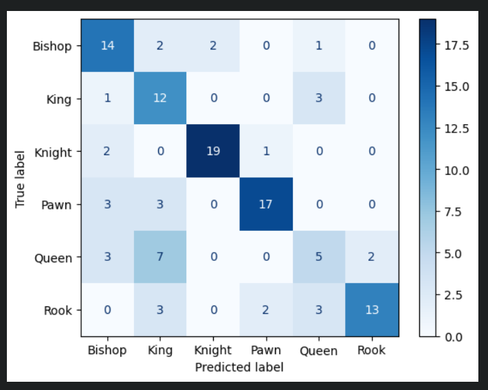

# Image Generation Machine Learning Model for Chess Piece Classification using the Image Data Set:
 **Data-set** https://www.kaggle.com/datasets/niteshfre/chessman-image-dataset

 **Google Drive Link:** https://drive.google.com/drive/folders/1VBTOCduA1bPF0c9Rur5MYaoxbF5m9y0L?usp=sharing

**Written By:** Alejandro Ruiz Garcia Rojas

## Selected Data Set
The selected Dataset was a dataset procuring images of chess pieces intended for their classification. The Data set is divided in 6 classes, depicting the diferent pieces within the game, regardless of their color, only taking into account their shape. The idea of this Model is to use this data-set to be able to clasify any chess piece by it's type, regardless of the color that the piece is.

The Data-set was obtained from kaggle, through the following link:
 https://www.kaggle.com/datasets/niteshfre/chessman-image-dataset
 
## Data Set Splitting
When generating Models it is important that we divide our Data-Sets in a Testing and Training Distribution, so that we can avoid any bias from the model when it comes to real/unforseen data. That is to say, we won't know for sure how the model would perform with real data, if we only know how it'd perform with training data. Because of that, we split our data in two, so that we can keep the training data as a "Real Example/Unseen example" and validate it's performance with data with which it was not trained on.

How do you determine the split however? Common practice indicates the use of the Pareto Principle, which states that 20% of the causes lead to 80% of all outcomes in most probability cases. [1] This has been empirically proven throughout history to be a common trend when it comes to data, and as such, it is a good practice to base our model on, as we will recieve 80% of the results we would obtain by using a 20% distribution of testing data. 

So the split of the data would be distributed like so:
- 80% - Training Data
- 20% - Testing Data

But we can split our training data even further, to allow for "validation", a process similar to testing, but used for the purpose of re-aligning or fixing hyperparameters within the model. Sort of like a "fine-tuning" process to better train the model once more after the initial training was done.

With that in mind, we can split our Data like so:
- 70% - Train Data
- 10% Validation Data
- 20% Testing Data

This split is conducted by importing the library ```split-folders```[2] which automatically splits the folders according to the parameters you give it.

We use ```splitfolders.ratio('Data',output="output",seed=1337,ratio=(0.7,0.1,0.2))```. The first parameter being the input folder, followed by the output folder, then a seed for randomation, followed by the ratio in which the images should be distributed.

The command should procure the following result:

- train
- val
- test

each folder containing it's appropriate distribution of images.

From then on, we use ```tensorflow``` in order to train, test, and pre-process our model. [4]

## Data Augmentation and Pre-Processing
Data Augmentation is a method in which we gather more data for our model, by editing, changing, rotating, or altering our pre-existing images and allowing the model to also train itself with the altered images. Using matrix operations, we generate more images or variations of them in order to give our model more data to train on. [3]

Within the code, we can see this being done through the functions of
- ```rescale``` rescaling the image. We Rescale the image so we can depict pieces small or big.
- ```rotation_range``` rotating the image within a given range. We rotate the image so we can depict images regardless of their position on board.
- ```width_shift_range``` Changing width within a range. We change the with of the image so we can depict between pieces that are wider or bigger.
- ```height_shift_range``` Changing height within a range. Taller Piece Identification.
- ```shear_range``` Stretching out an image within a range. We shear to stretch the image, so it can identify thinner pieces.
- ```horizontal_flip``` Flipping the image horizontally. The Piece will remain the same theoritically if flipped Horizontally. Might change slightly, Ex. Knights.

### Storing to disk
When training, you can store the model to the local disk by using ```save_to_dir``` giving it the corresponding path.
Additionally, you can add a prefix and format using ```save_prefix``` and ```save_format```

## Building and Training Model:
For the Model part we base ourselves on 3 Pre-made Models, two of which are using Transfer Training for their implementation, all based on 3 specific Articles and Classification Models.

The First Model seeks to replicate the classification model that was used to identify different types of plants based on their leaves. This model uses 5 Convolutional Layers followed by pooling layers respectively, and 3 Fully connected layers at the end.The kernels expand accordingly for each Convolutional Layer.[5]

The Second Model that was implemented is an adaptation of the previous model with Transfer Learning from VGG16, while also editing parameters based on another implemented Model for the classification of Rippened Fruit. Their initial model using VGG16's Convolutional structure and then using 3 Fully connected layers as well. [6]

Last but not least, we Implement a Model Transfer Training from Xception, due to it being listed as the best classification model for a benchmark test used for identifying and Classifying Chess Pieces, having a 94% Accuracy rating according to the Article, thus deeming it the best pre-trained model from the ones being compared. The model follows the same structure as our VGG16 one. [7]

The Training for each model is done through a total of 100 epochs, and using both our training and validation folders in order to compare wether the model is *overfitting* or *underfitting*.

## Loss, Accuracy and Analysis
After we finish with training our model we then plot out both our training loss and accuracy, as well as our validation loss and accuracy in order to properly evaluate the behavior of our model.

For the calculation of our loss we utilize `Categorical cross-entropy`.

Categorical cross-entropy was chosen as the loss function for this chess piece classification project because it is specifically designed for multi-class classification tasks.  Categorical cross-entropy works by measuring the difference between the true distribution of the labels (the actual class of each image) and the predicted probability distribution output by the model. This loss function effectively penalizes incorrect predictions, especially when the model is highly confident about an incorrect class, thus guiding the model to improve its accuracy over successive training epochs.

For our Initial Model we can observe that because it's complexity is rather simple, we are experiencing a severe case of underfitting, where the values do not go past 0.20 for the accuracy on either of our data-sets. (Train and Validation.) Respectively, we can observe that the loss function's result remains at a high number.

For our VGG16 Model we can observe that our model is indeed doing *overfitting* as the values from our training data are nearly perfect, while our validation values remain on a lower side. Having a difference of At-least 15% in it's accuracy value. And atleast a 30% Difference in loss value, we can notice that our model is training too well within the training data, but when put with real data it struggles to make accurate judgements.


Finally our Xception model can also be considered an Overfitted Model, as on average we see a difference between our Training data and Validation Data of 12%.

Finally, we procure a Confusion Matrix for Each model so we can observe which types of errors our model is falling victim to, each time it does a classification. It can give us quite a lot of information regarding our model, and can provide what needs to be tuned for better results.

When using our initial Model we generate A Confusion Matrix of:

When using our VGG16 Model we generate A Confusion Matrix in which we can infer:

 The model demonstrates high accuracy in classifying pieces like Knights and Pawns, with 19 out of 22 Knights and 17 out of 23 Pawns correctly identified. However, there are significant misclassifications between Kings and Queens, with 7 Queens misidentified as Kings and 3 Kings misidentified as Queens. This indicates a potential challenge for the model in distinguishing between these two pieces, possibly due to their visual similarities.


When using our Xception Model we generate A confusion Matrix of:


## References
[1] R. Dunford "The Pareto Principle" *Plymouth*,2014 Available: https://pearl.plymouth.ac.uk/bitstream/handle/10026.1/14054/TPSS-2014-Vol7n1_140-148Dunford.pdf?sequence=1&isAllowed=y [Accessed May 17,2024]

[2]J. Filter "splitfolders" 2022 Available: https://pypi.org/project/split-folders/ [Accessed May 17,2024]

[3] "What Is Data Augmentation?" *Amazon Web Services*, 2024 Available: https://aws.amazon.com/what-is/data-augmentation/#:~:text=Data%20augmentation%20is%20the%20process,machine%20learning%20(ML)%20models. [Accessed May 17,2024]

[4] "Tensorflow API Documentation" *Tensorflow* Available: https://www.tensorflow.org/api_docs/python/tf/keras/preprocessing/image/ImageDataGenerator#flow_from_directory [Accessed May 17, 2024]
[5] A. Badhri, K. El Moutaoikil, I. Badi, "A combined CNN and LSH for fast plant species classification" Jan 2020,Available: https://dl.acm.org/doi/10.1145/3372938.3372974 [Accessed May 27,2024]
[6]A. N. Hermana, D. Rosmala, M. G. Husada,"Transfer Learning for Classification of Fruit Ripeness Using VGG16" June 2021 Available:https://dl.acm.org/doi/10.1145/3450588.3450943[Accessed May 27,2024]
[7]D. Mallasen Quintana, A. A. del Barrio Garcia, M. Prieto Matias "LiveChess2FEN: a Framework for Classifying Chess Pieces based on CNNs" Dec 2020, Available:https://arxiv.org/pdf/2012.06858[Accessed May 27,2024]


